# 永生冲击：思想网络

> 本文档梳理「永生冲击」世界设定讨论中涉及的核心思想脉络，以人类已有的学术知识体系为坐标，建立理论间的关联。

---

## 一、核心问题

**永生技术出现后，国家、公司、个人三者的权力关系如何重构？**

这个问题横跨政治学、经济学、社会学、伦理学四个领域，涉及以下子问题：

1. 国家权力的基础是什么？能否被动摇？
2. 公司能否取代国家成为主导性权力实体？
3. 欧洲的人文价值导向如何阻碍技术传播？
4. 历史上是否存在类似的技术冲击？
5. 如何为虚构世界选择合适的理论建模工具？

---

## 二、理论框架总览

### 2.1 国家理论

#### 韦伯（Max Weber）：国家的定义

> **"国家是在给定领土内成功垄断了合法暴力使用权的人类共同体。"**

- 出处：《以政治为志业》（Politik als Beruf, 1919）
- 核心贡献：将国家的本质还原为**暴力垄断**，而非道德目的
- 与本项目的关联：永生公司掌握了一种比暴力更深层的强制力——**生死控制权**。如果韦伯的定义是正确的，那么问题变成：生死控制权能否绕过甚至取代暴力垄断？

#### 蒂利（Charles Tilly）：国家作为有组织的犯罪

> **"战争制造了国家，国家制造了战争。"**

- 出处：《强制、资本与欧洲国家》（Coercion, Capital, and European States, 1990）
- 核心论点：国家起源于暴力竞争中的幸存者。国家本质上是一台**征税-战争机器**：征税获取资源 → 用资源打仗 → 打赢的活下来继续征税
- 与本项目的关联：如果国家的核心功能是征税和战争，而永生公司的「维护费」本质上是一种比税收更有效的资源抽取方式（不交税坐牢，不交维护费会死），公司就在根源上挑战了国家的资源垄断

#### 选择者理论 / 致胜联盟理论（Bueno de Mesquita）

> **"领导人的一切行为，首先是为了保住权力。"**

- 出处：《独裁者手册》（The Dictator's Handbook, 2011），学术版为《战争的逻辑》（The Logic of Political Survival, 2003）
- 核心概念：
  - **选择者集合**（Selectorate）：有权参与领导人更替的人群
  - **致胜联盟**（Winning Coalition）：领导人实际需要保持满意的最小关键人群
  - 民主制 = 大联盟（需讨好多数选民）→ 倾向提供公共品
  - 威权制 = 小联盟（只需讨好军方/亲信）→ 倾向提供私人利益
- 与本项目的关联：**最适合作为国家行为的建模引擎。** 永生公司如果控制了致胜联盟成员的生死，就相当于劫持了国家的权力核心。不同政体的致胜联盟构成不同，导致国家对公司的态度天然分化

---

### 2.2 国际关系理论

#### 现实主义（Realism）

**经典现实主义（Morgenthau）**
> **"国际政治，如同一切政治，是对权力的争夺。"**

- 出处：《国家间政治》（Politics Among Nations, 1948）
- 核心：国家利益以权力为定义（interest defined as power）

**结构现实主义 / 新现实主义（Kenneth Waltz）**
> 国家行为由国际体系的结构（无政府状态+权力分布）决定，而非领导人的意图。

- 出处：《国际政治理论》（Theory of International Politics, 1979）
- 核心：无政府体系 → 自助 → 安全困境 → 制衡或追随

**与本项目的关联**：
- 现实主义解释**国家之间**的行为：技术主权国家之间的竞争与制衡、技术边缘国家的安全困境
- 延寿技术作为权力的新维度——拥有独立延寿能力的国家 ≈ 核武国家，是真正的大国
- 局限：它把国家当黑箱，不解释公司如何从内部掏空国家

#### 自由制度主义（Liberal Institutionalism）

> 国际制度和合作可以缓解无政府状态的冲突。

- 代表人物：Robert Keohane
- 出处：《霸权之后》（After Hegemony, 1984）
- 与本项目的关联：设定中的「全球生命公约组织」（GLCA）就是自由制度主义的产物——试图用制度管理延寿技术的分配。但正如现实中的联合国一样，「有权无力」

#### 建构主义（Constructivism）

> **"无政府状态是国家造出来的。"**

- 代表人物：Alexander Wendt
- 出处：《国际政治的社会理论》（Social Theory of International Politics, 1999）
- 核心：国家利益不是客观的，是由身份、规范、观念**建构**的
- 与本项目的关联：
  - 「延寿是人权还是商品」这个定义之争，决定国家政策的走向
  - 欧洲的人文价值导向阻碍技术传播——这正是建构主义的案例：观念塑造利益、利益决定行为
  - 最适合用于**人物对话和思想冲突的写作**

---

### 2.3 政治经济学

#### 马克思主义国家理论

> **国家是统治阶级的执行委员会。**

- 出处：《共产党宣言》（1848），恩格斯《家庭、私有制和国家的起源》
- 核心：国家不是中立的，是**阶级统治的工具**。「国家利益」是统治阶级利益的伪装
- 与本项目的关联：
  - 揭露「国家利益」话语的虚伪性——当国家说「延寿技术是战略资源」，可能实际意思是「我们的统治者需要延寿」
  - 永生技术创造了一种新型阶级分裂——不是按财富，而是按**生命长度**
  - 但经典马克思主义的局限在于：它假设国家管理者和资本家利益一致，而选择者理论指出二者可能存在自主性张力

#### 葛兰西（Antonio Gramsci）：文化霸权

> 统治阶级不只靠暴力，更靠让被统治者**主动接受**现有秩序的合理性。

- 出处：《狱中札记》（Quaderni del carcere, 1929-1935）
- 与本项目的关联：
  - 永生公司不需要暴力控制社会——它只需要让人们相信「延寿是理所当然的消费品、公司提供延寿是理所当然的」
  - 「死亡是失败」这种观念的形成，就是文化霸权运作的结果
  - 裂缝社区的抵抗本质上是**反霸权实践**

#### 波兰尼（Karl Polanyi）：双向运动

> 市场扩张到一定程度，社会会自发产生保护性反向运动。

- 出处：《大转型》（The Great Transformation, 1944）
- 核心：市场不是自然产物，是被政治力量强行创造的。当市场把土地、劳动、货币「商品化」到威胁社会存续时，社会会反弹
- 与本项目的关联：
  - 永生技术把**生命本身**商品化——这是波兰尼所说的「虚构商品」的终极形态
  - 波兰尼预测的「反向运动」在设定中对应：裂缝社区、自然选择者、拒斥型国家、以及欧洲的伦理管制
  - 核心问题：反向运动这次还能赢吗？当市场控制的不是「劳动」而是「生命」，保护社会的力量还够用吗？

---

### 2.4 垄断与反垄断

#### 标准石油案与反托拉斯运动

- **事实**：洛克菲勒的标准石油（Standard Oil）在1880-1900年代控制了美国约90%炼油产能
- 1890年《谢尔曼反托拉斯法》（Sherman Antitrust Act）通过
- 1911年最高法院判决拆分标准石油为34家公司
- **讽刺**：拆分后各部分市值之和超过原公司，洛克菲勒更富了；碎片公司（ExxonMobil, Chevron等）至今仍为全球巨头

**关键机制**：

| 国家能拆标准石油的原因 | 国家可能拆不了永生公司的原因 |
|---|---|
| 石油可替代（其他能源存在） | 延寿不可替代 |
| 拆分代价：短期油价波动 | 拆分代价：治疗中断可能致死 |
| 公众支持拆分 | 公众恐惧拆分 |
| 竞争资本推动反垄断 | 竞争者极少（技术壁垒过高） |
| 石油公司没有控制政客的生死 | 延寿公司可能控制政客的生死 |

#### 东印度公司模型

- 英国东印度公司（1600-1874）是历史上最接近「公司即国家」的案例
- 拥有自己的军队、铸币权、外交权、司法权
- 统治印度次大陆近两个世纪
- 最终被英国王室收回权力（1858年印度政府法案）
- **教训**：公司可以在短期内取代国家功能，但长期来看，国家的合法性和暴力垄断是公司无法稳定维持的

---

### 2.5 欧洲思想传统与生命伦理

#### 预防性原则（Precautionary Principle）

> 当一项行为可能造成不可逆伤害时，缺乏科学确定性不应成为推迟预防措施的理由。

- 法律化：写入欧盟条约（《里斯本条约》第191条）
- 实践：GDPR、EU AI Act、生物技术监管
- 与本项目的关联：欧洲延寿管制的制度逻辑根源。延寿技术「完全安全」可能需要50年验证——按预防原则，50年内部署会被限制

#### 康德式人的尊严（Menschenwürde）

> **"人永远是目的，不能仅仅是手段。"**

- 出处：康德《道德形而上学基础》（1785）
- 在德国基本法第1条中具有宪法地位
- 与本项目的关联：
  - 延寿干预是「治疗」还是「增强」？康德框架下，治疗是恢复人的尊严，增强可能是把人当作手段（为了活更久而改造自己）
  - 这个分类直接决定欧洲的监管路径——「增强」不受公共医疗优先保障

#### 平等主义传统

- 根植于欧洲社会民主运动，核心信条：**关键资源（教育、医疗、住房）不应由市场独占分配**
- 延伸逻辑：「如果延寿不能人人都有，那就谁都不该有」
- 与本项目的关联：道德上无懈可击，实践上导致延寿部署延迟。**善良成为代价。**

---

### 2.6 历史类比

| 类比事件 | 与永生技术的相似性 | 关键差异 |
|---|---|---|
| **20世纪公共卫生革命** | 人均寿命翻倍，家庭结构重塑，南北差距扩大 | 渐进式、无窗口期、普惠性更强 |
| **英国圈地运动** | 不可逆的窗口期——错过就被永久性地推入底层 | 剥夺的是土地，不是时间/生命 |
| **古登堡印刷术** | 瓦解旧秩序的底层假设（教会解释权垄断），引发长期冲突 | 改变的是信息流通，不是人的身体 |
| **器官移植伦理** | 稀缺医疗资源的分配困境，南北器官交易，身体商品化 | 规模小得多，不涉及整体寿命差异 |
| **标准石油垄断** | 单一实体控制关键资源，国家反垄断博弈 | 石油可替代，拆分不致死 |

---

## 三、思想网络：概念关联图

```mermaid
graph TD
    ROOT["永生技术冲击"] --> A["国家权力基础"]
    ROOT --> B["公司权力崛起"]
    ROOT --> C["个人处境"]

    A --> A1["暴力垄断<br/>Weber"]
    A --> A2["征税-战争循环<br/>Tilly"]
    A --> A3["致胜联盟<br/>Bueno de Mesquita"]
    A --> A4["合法性来源"]

    B --> B1["生死控制权<br/>超越暴力的强制"]
    B --> B2["身体即领地<br/>超越领土的控制"]
    B --> B3["维护费即税<br/>超越征税的抽取"]
    B --> B4["服务条款即法律"]

    A1 -.->|"被绕过"| B1
    A2 -.->|"被替代"| B3
    A4 -.->|"被劫持"| B1

    C --> C1["生命鸿沟"]
    C --> C2["意义真空"]
    C --> C3["量化异化"]

    D["国际格局"] --> D1["现实主义<br/>Morgenthau/Waltz"]
    D --> D2["建构主义<br/>Wendt"]
    D --> D3["自由制度主义<br/>Keohane"]

    D1 --> D11["技术主权国 = 新核武国家"]
    D2 --> D21["'延寿是人权还是商品'<br/>定义之争"]
    D3 --> D31["GLCA = 延寿版联合国<br/>有权无力"]

    E["社会反向运动<br/>Polanyi"] --> E1["裂缝社区"]
    E --> E2["自然选择者"]
    E --> E3["拒斥型国家"]
    E --> E4["欧洲伦理管制"]

    F["文化霸权<br/>Gramsci"] --> F1["'死亡是失败'<br/>观念植入"]
    F --> F2["公司叙事<br/>'我们让你活着'"]

    G["阶级分析<br/>Marx"] --> G1["生命长度即阶级"]
    G --> G2["'国家利益'的阶级本质"]

    E4 --> H["欧洲困境"]
    H --> H1["预防性原则"]
    H --> H2["康德式尊严"]
    H --> H3["平等主义悖论<br/>'人人有才能有，<br/>否则谁都不该有'"]

    style ROOT fill:#e74c3c,color:#fff,stroke:none
    style A fill:#3498db,color:#fff,stroke:none
    style B fill:#e67e22,color:#fff,stroke:none
    style C fill:#9b59b6,color:#fff,stroke:none
    style D fill:#2ecc71,color:#fff,stroke:none
    style E fill:#1abc9c,color:#fff,stroke:none
    style F fill:#f39c12,color:#fff,stroke:none
    style G fill:#c0392b,color:#fff,stroke:none
    style H fill:#8e44ad,color:#fff,stroke:none
```

---

## 四、建模推荐：分层架构

在为「永生冲击」世界建模时，建议将上述理论按功能分层使用：

| 层级 | 功能 | 理论工具 | 输出 |
|---|---|---|---|
| **第一层：地缘骨架** | 国家之间的格局、对抗、联盟 | 现实主义（Waltz） | 四类国家分类、三条前线 |
| **第二层：内部引擎** | 每个国家的具体行为逻辑 | 选择者理论（Bueno de Mesquita） | 致胜联盟构成 → 政策预测 |
| **第三层：叙事冲突** | 人物之间的观念争论 | 建构主义（Wendt） | 定义之争、价值碰撞 |
| **第四层：批判视角** | 揭露话语与现实的裂缝 | 马克思主义 + 葛兰西 | 讽刺感、反思空间 |
| **第五层：社会反弹** | 抵抗运动的来源与逻辑 | 波兰尼（双向运动） | 裂缝社区、自然选择者 |

---

## 五、待深挖方向

- [ ] 中国模式的国有化路径是否可行？（国家自主性 vs 技术复杂性）
- [ ] 军队依赖公司延寿时，国家暴力垄断是否实质性瓦解？
- [ ] 延寿公司之间的竞争结构（寡头均衡 vs 赢家通吃）
- [ ] 全球南方视角：依附理论（Wallerstein世界体系论）的适用性
- [ ] 个人层面：福柯的生命政治（Biopolitics）框架在延寿时代的展开

---

## 六、关键参考文献

### 政治学与国家理论
- Weber, M. (1919). *Politik als Beruf*（以政治为志业）
- Tilly, C. (1990). *Coercion, Capital, and European States*（强制、资本与欧洲国家）
- Bueno de Mesquita, B. et al. (2003). *The Logic of Political Survival*
- Bueno de Mesquita, B. & Smith, A. (2011). *The Dictator's Handbook*（独裁者手册）

### 国际关系
- Morgenthau, H. (1948). *Politics Among Nations*（国家间政治）
- Waltz, K. (1979). *Theory of International Politics*（国际政治理论）
- Wendt, A. (1999). *Social Theory of International Politics*
- Keohane, R. (1984). *After Hegemony*（霸权之后）

### 政治经济学
- Marx, K. & Engels, F. (1848). *The Communist Manifesto*
- Gramsci, A. (1929-35). *Prison Notebooks*（狱中札记）
- Polanyi, K. (1944). *The Great Transformation*（大转型）

### 垄断与公司权力
- Tarbell, I. (1904). *The History of the Standard Oil Company*
- Chernow, R. (1998). *Titan: The Life of John D. Rockefeller*

### 生命伦理
- Kant, I. (1785). *Groundwork of the Metaphysics of Morals*（道德形而上学基础）
- Habermas, J. (2003). *The Future of Human Nature*（人性的未来）

### 待阅读/待整合
- Foucault, M. (1976). *The Birth of Biopolitics*（生命政治的诞生）
- Wallerstein, I. (1974). *The Modern World-System*（现代世界体系）
- Agamben, G. (1998). *Homo Sacer*（神圣人）
